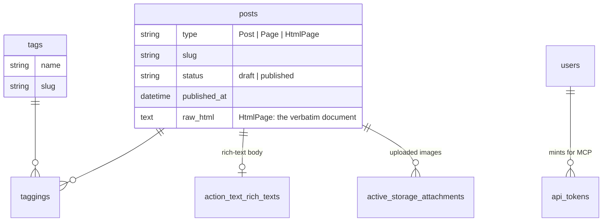

# chronicles

**A blog you *rewrite*, not one you configure.** The open-source engine behind [nityesh.com](https://nityesh.com) — one vanilla Rails app, MIT licensed, small enough to hold in your head, that your coding agent both operates and reshapes.

**→ [Read the pitch at nityesh.com/chronicles](https://nityesh.com/chronicles/)** — a landing page this engine published, byte-for-byte, over MCP.

> I break it constantly and chronicle the breakage. There is no stable version — fork it and it's yours. If it breaks, ask your agent to fix it.

That's the entire support policy. It's also most of the pitch.

## Ghost is good. WordPress is good. So why build another one?

Because every blog platform ever made — Ghost, WordPress, Substack, all of them — answers the question *"how do I change this?"* with a settings page, a theme marketplace, or a plugin API. Someone else decided in advance which knobs you're allowed to turn.

Chronicles answers that same question with **the source code.** A vanilla Rails app small enough to hold in your head, yours under an MIT license. Not a template you fill in — a codebase you own.

> On most platforms, "infinite customizability" is something a marketing team wrote. Here it's just the license.

That's the asymmetry. The missing feature — comments, a second author, a podcast feed, a homepage that looks nothing like this one — isn't a roadmap item you wait for or a plugin you hope exists. **It's a conversation you haven't had with your agent yet.**

This isn't a promise, it's proof: [nityesh.com](https://nityesh.com) runs on it, you're reading its complete source, and the production landmines are already mapped (see [Conventions and landmines](#conventions-and-landmines-read-before-changing-anything) — those bugs are paid for so you don't pay them twice).

## Your agent doesn't just write on it. It runs it, and rewrites it.

Owning the source only matters if changing it is cheap. It is — because the same agent you write with is the one that reshapes the platform underneath you. Three levels, each one deeper.

1. **It writes with you.** An MCP server at `/mcp` with 13 tools — your agent lists, drafts, tags, schedules, publishes, unpublishes, uploads images, embeds YouTube and X, and edits with surgical body patches, never wholesale rewrites of your prose. claude.ai connects from a pasted URL; Claude Code connects with a token minted at `/writing/connect`.
2. **It ships pages, not just posts.** Agents are unreasonably good at writing beautiful HTML — so here a complete hand-authored document is a first-class publication, not an attachment. `create_html_page` serves it byte-for-byte at a root slug: no blog chrome, in your sitemap, canonical injected, screened on the way in so it can't ship without a `<title>` or with asset paths that 404. All the SEO of a regular post, none of the template. Live proof: the [landing page](https://nityesh.com/chronicles/) for this repo and [nityesh.com/hands-on-deck](https://nityesh.com/hands-on-deck/) were both published this way, byte-identical to their hand-crafted source.
3. **It rewrites the platform.** Want comments? A second author? A different homepage entirely? Those aren't features you're missing — they're features you haven't asked for yet. You hold the complete source in the simplest full-stack framework ever made for one person. And you don't hold it alone: batteries included, and one of the batteries is a Rails expert. [`.claude/skills/beautiful-rails-like-dhh`](.claude/skills/beautiful-rails-like-dhh/SKILL.md) ships in the repo with the 37signals conventions this codebase was written under — Hotwire, no SPA, small files, the way Basecamp, HEY, Campfire and Fizzy are built. Claude Code loads it the moment it opens the repo, so *"make this mine"* comes back in the house style instead of a React-flavoured fork.

## A product manages you. A codebase answers to you.

| A hosted platform | Chronicles |
|---|---|
| Change what the settings screen allows | Change anything — it's Rails you can read |
| Wait for the roadmap, or the right plugin | Ask your agent; ship it this afternoon |
| Customization is a feature you rent | Customization is the MIT license |
| Your archive and SEO live on their terms | Your archive, URLs and SEO arrive intact |
| Support tickets and version upgrades | Fork it, own it, never look back |
| The engine is a black box you configure | The engine is the product, and it's yours |

## What's in the box

This ran a real publication before it was open-sourced. The port from Ghost was parity-gated — a script compared both sites URL by URL until they matched. My Search Console never noticed the switch. So this is a real publishing engine, not a starter kit:

- **The writing room** at `/writing` (sign-in required): drafts, scheduled, published, pages, HTML pages. A rich-text editor ([Lexxy](https://github.com/basecamp/lexxy), from Basecamp) that autosaves every 2 seconds. Publish now, or pick a future time and a background job does it for you.
- **HTML pages**: a third content kind (`HtmlPage < Page`) — one complete hand-authored HTML document served byte-for-byte at a root slug, for landing pages whose design *is* the content. Agents author them over MCP (`create_html_page` / `update_html_page`), which screens the document on the way in: `<title>` required, canonical link injected, missing meta description and relative asset paths reported. The writing UI edits them in a plain textarea and never touches the bytes.
- **The reader experience**: designed homepage, tag pages, RSS at `/rss`, a Ghost-shaped sitemap index, full SEO/OG/Twitter/JSON-LD head tags, and 301s that keep old links alive forever.
- **A Ghost importer** (`lib/ghost/`): posts, drafts, pages, tags, images, embeds — mobiledoc in, Action Text out. One-time and additive; re-importing wants a fresh database.
- **MCP + OAuth for agents**, as above. Dynamic client registration included, so an agent can onboard itself from a pasted URL.
- **A Rails expert, included** ([`.claude/skills/beautiful-rails-like-dhh`](.claude/skills/beautiful-rails-like-dhh/SKILL.md)): the operating manual this app was built under, backend and Hotwire frontend, in 16 reference chapters — worked features and a review checklist among them. Claude Code auto-loads it from the repo; other agents can read `SKILL.md` directly.
- **Site identity in one database row** (`Setting`): title, author, logo, domain, social handles. Rebrand the whole site without touching Ruby.
- **Email capture**: a subscribe form that stores addresses (list at `/writing/subscribers`). Full honesty: it *collects* subscribers; it does not yet *send* them anything. RSS delivers today; your subscribers wait patiently in a table. Sending is a chapter I haven't written — your agent may write yours sooner.
- **Kamal deploy** to one cheap VPS. Push to `main`, tests pass, site ships. SQLite for everything (database, jobs, cache, cable), no build step, no node_modules. Runs comfortably on a $6 droplet.

What's deliberately *not* in the box: comments, analytics, payments, memberships, multi-author. Not because any of it is hard — because one person hasn't needed it yet. This isn't a feature matrix that has to look complete; it's a codebase honest about being small. It ships with one author because I am one person. If you want a second, that's an afternoon — not a paywall.

## Under the hood

One Rails 8 app, no moving parts you didn't ask for. If a change would add a service or a build tool, it's probably the wrong change.

| Layer | Choice | Boring on purpose |
|---|---|---|
| Framework | Rails 8, server-rendered ERB | one language, one process |
| Database | SQLite | one file on one disk — no Postgres |
| Jobs · cache · cable | Solid Queue · Solid Cache · Solid Cable | all in SQLite; no Redis, no Sidekiq |
| Assets | Propshaft + import maps | no build step, no `node_modules` |
| Interactivity | Hotwire (Turbo + Stimulus) + hand-written CSS | no JS framework, nothing transpiles |
| Rich text | Action Text + [Lexxy](https://github.com/basecamp/lexxy) | Basecamp's editor, 2-second autosave |
| Agent API | MCP server + OAuth 2.1 (Doorkeeper) | 13 tools, dynamic client registration |
| Auth | hand-rolled sessions + `has_secure_password` | it's a one-author site |
| Deploy | [Kamal](https://kamal-deploy.org) → one VPS behind Cloudflare | push to `main` → CI → ship, ~$6/mo |

### The data model

Everything you publish is one row in `posts`, discriminated by `type` — [single-table inheritance](https://guides.rubyonrails.org/association_basics.html#single-table-inheritance-sti). A post carries its own slug, status, schedule and SEO; its body lives in Action Text, its images in Active Storage.



| Table | Holds | Key columns |
|---|---|---|
| `posts` | every article, page and HTML page (STI on `type`) | `type`, `slug`, `status`, `published_at`, `raw_html` |
| `tags` + `taggings` | tags, and the post↔tag join | `slug`, `name` |
| `settings` | the single row that makes the site yours | `site_title`, `author_name`, `production_host`, `twitter_handle` |
| `subscribers` | captured emails (RSS today, newsletter when you write it) | `email` |
| `users` | the author(s) | `email_address`, `password_digest` |
| `api_tokens` | bearer tokens for Claude Code over MCP | `token_digest`, `expires_at` |

Behind those sit the framework-managed tables you rarely touch by hand: Action Text bodies, Active Storage blobs, the OAuth application/grant/token trio for MCP, and the MCP + web session rows.

The gotchas that bit me — Ghost URL parity, scheduled-publish identity checks, the autosave contract, Lexxy styling — are written down under [Conventions and landmines](#conventions-and-landmines-read-before-changing-anything), paid for so you don't pay them twice.

## Is this for you?

**Fork this if:** you run a coding agent as a matter of course; your writing and side projects are scattered across platforms you only rent; you want a site your agent can operate *and* reshape; or you're leaving Ghost and want your archive, URLs, and SEO to arrive intact.

**Don't fork this if:**

- You don't use a coding agent. This is a codebase, not a template. Ghost and WordPress are right there, and they're good.
- You want a maintained product with support, versions, and a roadmap. The support policy is the second sentence of this README.
- You won't run a server. It needs a real box with a disk (~$6/month). If you want free static hosting, Astro and Hugo are lovely.
- You expect to `git pull` my improvements. There is nothing to pull. `main` is my live site and I will break it whenever I feel like it. Fork it, make it yours, never look back — that's the whole model.

## Fork it

1. Fork the repo.
2. Hand it to your coding agent: *"Read the README. Make this mine."*
3. Answer its questions — your name, your domain, whether you have a Ghost export — then point your DNS at your box, and publish.

There is no installer. Your agent is the installer. Everything it needs is below.

## Running locally

Ruby comes from [mise](https://mise.jdx.dev) (`.ruby-version` → 3.4.7). Prefix commands with `mise exec --` if ruby isn't on your PATH.

```bash
bundle install
bin/rails db:prepare     # creates + migrates SQLite
bin/rails db:seed        # creates the one author, prints a password ONCE
bin/rails server         # http://localhost:3000 — /writing to sign in
```

Tests and lint (both must be green before pushing):

```bash
bin/rails test           # unit + integration
bin/rails test:system    # rack_test driver — see "Testing" below
bin/rubocop              # bare, no args — the config excludes views on purpose
```

## Deploying

Pushing/merging to `main` auto-deploys: the `deploy` job in `.github/workflows/ci.yml` runs `bin/kamal deploy` after tests pass. Manual: `bin/kamal deploy` from a machine with the deploy key. Your fork needs its own repo secrets — the full list of deploy env vars is in the comment block at the top of `config/deploy.yml`.

- Target: a single VPS behind Cloudflare; kamal-proxy owns 80/443 and routes by Host header.
- The origin server IP stays out of git: `config/deploy.yml` is ERB-evaluated and reads `KAMAL_SERVER_IP` from the environment (CI injects it from a repo secret).
- An sslip.io fallback host (built from `KAMAL_SERVER_IP`) exists only for Let's Encrypt cert provisioning; going live = edit `proxy.hosts` in `config/deploy.yml` + point DNS.
- One named volume persists the SQLite databases and uploads. Migrated Ghost images are served from a second volume at `/content/images/...` — they are **not** in the repo or in Active Storage.
- Health check: `/up` (excluded from the force_ssl redirect; don't remove that exclusion).
- `script/parity_check.rb` compares a set of reference URLs between two hosts — useful after risky changes: `PARITY_BASE=http://localhost:3000 ruby script/parity_check.rb`.

## Map

| Where | What |
|---|---|
| `app/models/post.rb` | The heart: slugs, publish/schedule/unpublish, `Page < Post` (STI) |
| `app/models/page.rb` | Pages override only the seams (`og_type`, `body_class`, …) |
| `app/models/setting.rb` | The one row that makes the site yours |
| `lib/ghost/` | One-time Ghost import (mobiledoc → Action Text HTML). Keep: it documents the stored-content shape |
| `app/controllers/writing/` | The authoring UI (posts, pages, tags, publishings, embeds) |
| `app/tools/` + `config/initializers/mcp.rb` | The 13 MCP tools and the server doctrine |
| `app/views/shared/_meta.html.erb` | All SEO/OG/Twitter head tags, shaped for Ghost parity |
| `app/javascript/controllers/` | Stimulus controllers a reader's page uses: reveal, cards, tweets |
| `app/javascript/writing/` | The writing room's JS entry (`index.js`: Lexxy + the editor's controllers — autosave, autogrow, slug, embed, editor, dashboard…) |
| `app/assets/stylesheets/application.css` | The whole design, hand-written. Public typography + editor canvas share selector lists |
| `.claude/skills/` | The Rails expert that ships with the repo: 37signals conventions, auto-loaded by Claude Code |

## Conventions and landmines (read before changing anything)

**Doctrine.** Vanilla Rails, the 37signals way: server-rendered ERB, Hotwire, hand-written CSS, no JS framework, no build step, underdo. If a change needs a package.json, it's probably the wrong change.

**Ghost parity is load-bearing.**

- Public URLs end in a trailing slash (Ghost's shape). Never hand-type `trailing_slash: true` — use the `public_post_path`/`public_tag_path` helpers. Admin paths stay bare; `ApplicationController` redirects public requests to the slashed form.
- Imported post bodies contain Ghost's `kg-*` card markup (`kg-image-card`, `kg-gallery-card`, …) — the importer wrote it there on purpose. The `kg-*` CSS rules must stay or imported posts' images/galleries/embeds break. The `gh-*` class *names* are legacy and may be renamed someday, but the styles they carry ARE the site's design.
- Sitemap URLs, RSS shape, and the `/author/:slug` redirect all match what Ghost served. Don't tidy them.

**STI.** `HtmlPage < Page < Post`, discriminated by `type`. Use the `Post.articles` scope for posts-only queries — never hand-type `where(type: "Post")`. `posts#show` and `Writing::PostsController#set_post` are unfiltered **on purpose** (pages are served/edited through them; the comments at those sites say so). The one deliberate exception: `Writing::PagesController` and the dashboard's Pages bucket are scoped to exact type `"Page"` — an HtmlPage opened in the Lexxy form would have its raw document overwritten by an Action Text body.

**Publishing.** `published_at` on a draft with a future time = a schedule. The enqueued job carries its scheduled time and publishes only if `published_at` still equals it — that identity check is what stops a stale job from republishing a post that was since unpublished. Two traps: timestamps are **floored to whole seconds** (SQLite keeps µs, the job serializer keeps ns — sub-second stamps break the equality; tests must floor too), and if you ever change `PublishJob#perform`'s signature, jobs already sitting in the production queue will error when they fire — check for scheduled posts before deploying such a change.

**Autosave contract.** Autosave is the *only* save in the editor — there is no Save button — so the `X-Autosave` header buys exactly five answers and nothing else. On an existing record: `204` on success, **bodyless** `422` on validation failure (never `render :edit` — it would repaint the page mid-keystroke), **bodyless** `409` when another tab saved first (the form carries `lock_version`, Rails' optimistic locking raises, the client stops saving and asks for a reload — no merge), and `200` with a Turbo Stream when the save moved the slug (below). Every save that lands also carries `X-Lock-Version`, the version it made, which the client adopts before its next save — including the explicit feature-image submit, read off `turbo:submit-end`. Saves are serialised in the client (each awaits the one before it); a failed save keeps no state — the next keystroke arms the timer again, and that is the retry; and the body also sits in `localStorage` (`local-save`, keyed by `dom_id`) until a save is confirmed, so a crash offers the text back on reopen. On the first keystroke of a new one, the mint: `201` carrying `Location` (the PATCH target the client adopts verbatim), `X-Post-Id`, and a Turbo Stream body that fills the four empty slots the form left for a saved record — Publish, its popover, Delete, the tag mint. All four shapes live in `Writing::Autosaving`, shared by the posts and pages controllers, because when each spelled them out for itself they drifted. Explicit saves are normal Turbo submits.

**The slug is the server's until the writer takes it.** This is what lets the URL live on the canvas under the subtitle instead of in a panel. While the field is in auto mode (`data-auto` — "still the editor's invention", seeded by the server on a new post or a still-untitled draft and ended by the writer's first keystroke in the field) the editor sends *no* slug at all: `Post#generate_slug` derives it from the title on every save, suffixing past anything taken or reserved, and the answer hands back what it kept (`X-Slug`) for the field to display. So the canvas can never show a URL the site doesn't serve, and a draft minted at "Why I mov" doesn't keep `/why-i-mov/`. From then on the slug is sent, but only on `change` — a half-typed URL is not a rename (the caret's position in the DOM is what says so; a remembered flag once stuck and took the slug off every save for a session), and abandoning one loses nothing else. **Absence of `post[slug]` is what asks the server to derive** — never a blank value, which means the writer emptied the field and is refused like any other name the post can't have. An emptied field is put back from the last slug the server confirmed.

**A rename is answered like the mint**, with the same Turbo Stream (morphed, not replaced — it lands every couple of seconds while a title is being typed, and a replace would throw away a half-typed tag name or a publish time being picked) and the same headers (`Location`, `X-Edit-Url`, `X-Slug`, `X-Post-Id`), because a rename installs exactly what the mint did: the publish form, the delete form, the tag mint and the untitled note all address the record, and every one of them was stamped from the slug that just moved. Re-rendering them from `create.turbo_stream.erb` is what stops Publish from posting to a URL that stopped existing two keystrokes ago. The client adopts each URL verbatim and never builds one out of a slug.

**The editor's save never refuses a keystroke over a URL.** `Post#save_keeping_url` is the verb: a name that isn't free (someone holds it, or the router does) leaves the slug where it was and everything else — the prose — still saves; the availability frame beside the field is what says why. Every other caller (the MCP tools, the console) still gets the uniqueness and reserved-name validations, because they can read an error and a writer mid-sentence can't. The tag-mint input is form-associated elsewhere and must not trigger autosave. Because there is no Save button, leaving is guarded: an in-app Turbo visit waits for the pending save, and a tab close raises the browser's own dialog. Turbo does not fire `turbo:before-visit` for history navigation, so **Back takes a different route**: after a Turbo visit it is a restore visit and `disconnect → flush` lands the save (the document survives); otherwise it is a real unload and the dialog catches it. On the restore path nothing awaits the flush, so a save that fails during a Back goes unreported.

**Editor (Lexxy).** Its content styles are `:where(.lexxy-content)`-scoped at zero specificity — *designed* to be overridden by the app. WYSIWYG parity works by factoring the published `.gh-content` typography into selector lists **shared** with `.editor-canvas__body`: change one, you change both, which is the point. Theme the chrome via `--lexxy-*` CSS variables. Never fight the gem with `!important`. Note the site's `html{font-size:62.5%}`: naked `rem` values from third-party CSS compute smaller than you expect. Readers never download Lexxy: the public layout's entry is `application.js`, the writing layout's is `writing` (`app/javascript/writing/index.js`), and only the latter imports the editor. A controller only the author's pages wear goes in `app/javascript/writing/`, not `controllers/` — `eagerLoadControllersFrom` ships everything under `controllers/` to every public page.

**Caching.** Public pages use fragment caches keyed on posts plus `fresh_when` ETags. Anything rendered inside `cache post` that lives on another record needs a touch path — e.g. `Tag` touches its posts on rename. If you add such data, add the touch.

**Testing.** The system-test driver is `rack_test` — **no JavaScript executes** (documented in `application_system_test_case.rb`). JS behavior is covered by unit/integration tests + manual dogfood; don't add a browser driver casually, and don't trust a green system test to prove a Stimulus controller works. CI runs on Linux: its clock has ns precision where macOS has µs — another reason time-sensitive tests use floored stamps.

**Style.** Comments are sparse and explain *why*, never what. Rationale goes in commit messages. Match this or the reviewers (human and otherwise) will send it back.

## For agents

Read [`.claude/skills/beautiful-rails-like-dhh/SKILL.md`](.claude/skills/beautiful-rails-like-dhh/SKILL.md) before you write or review any code here — it's the taste the reviewers hold you to. Everything above applies to you, plus: run `bin/rails test && bin/rubocop` before declaring anything done; keep diffs surgical; PRs need a review-pack body (what/why/verification) and are **never self-merged** — a human merges. If you're setting this up for a new owner: interview them, fill the `Setting` row, run the Ghost import if they have an export, deploy with Kamal. Measure the writing experience against Ghost's editor and the codebase against 37signals' taste. When in doubt, underdo.

## License

MIT. The copyright line says my name, but the whole point is that the next commit says yours.
