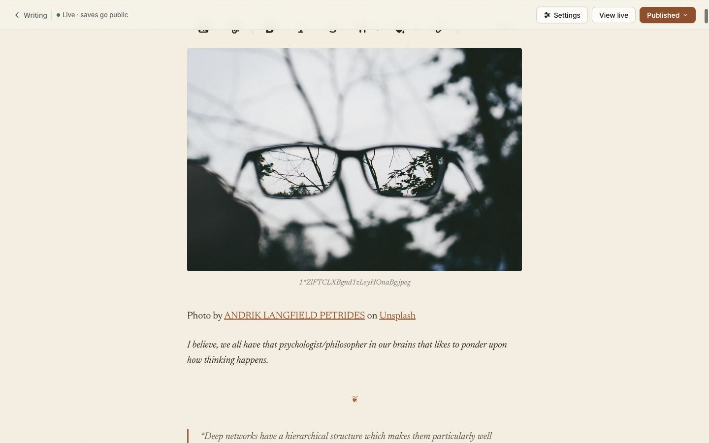
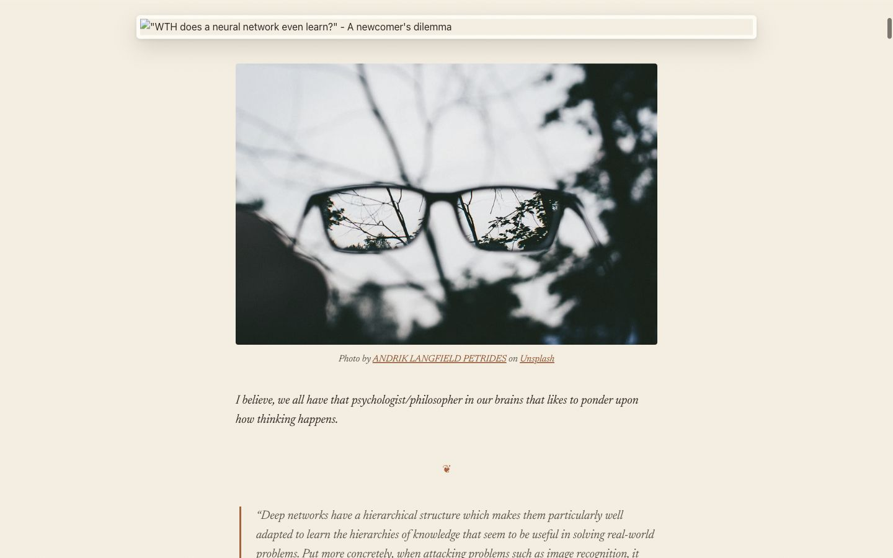
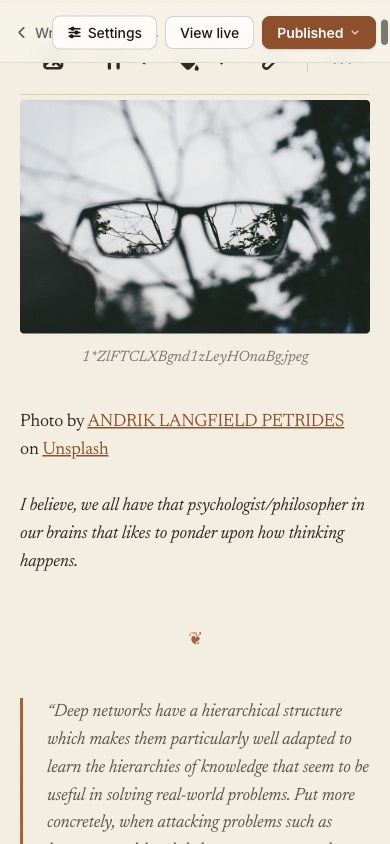
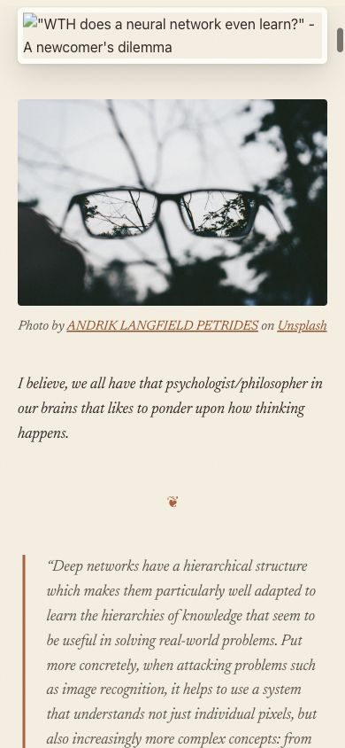
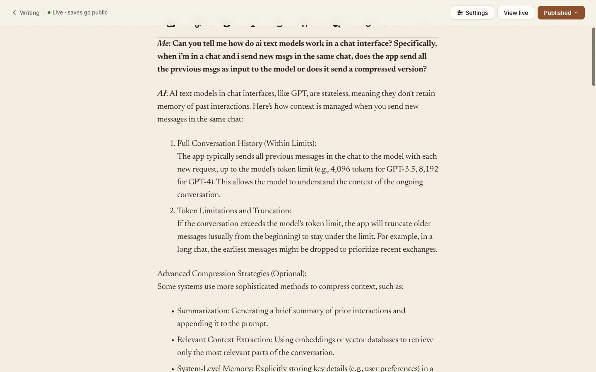
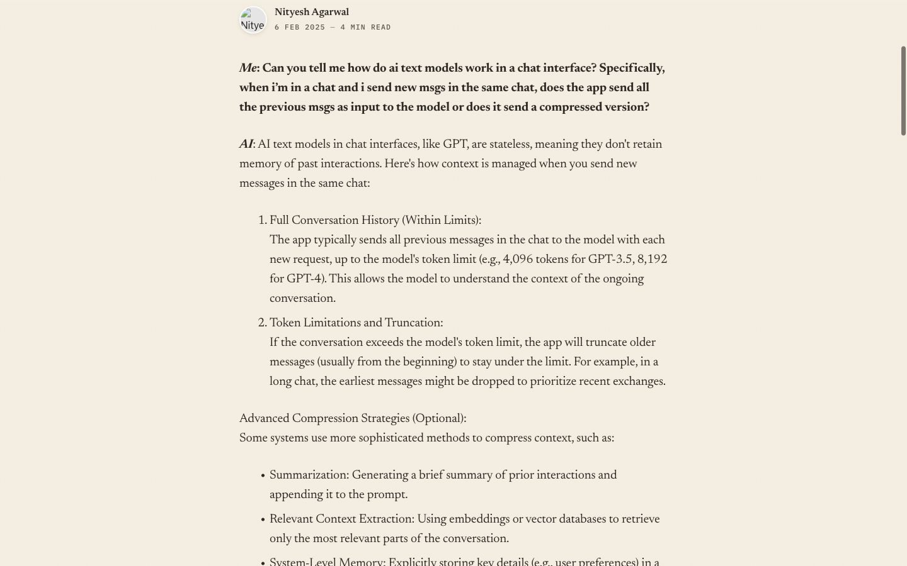
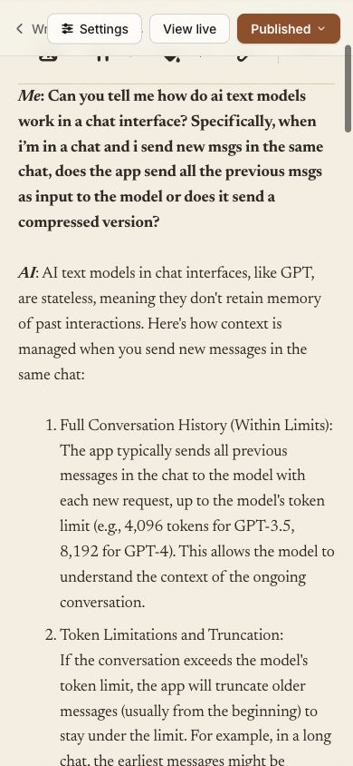
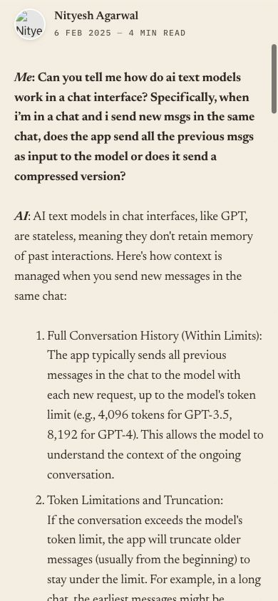
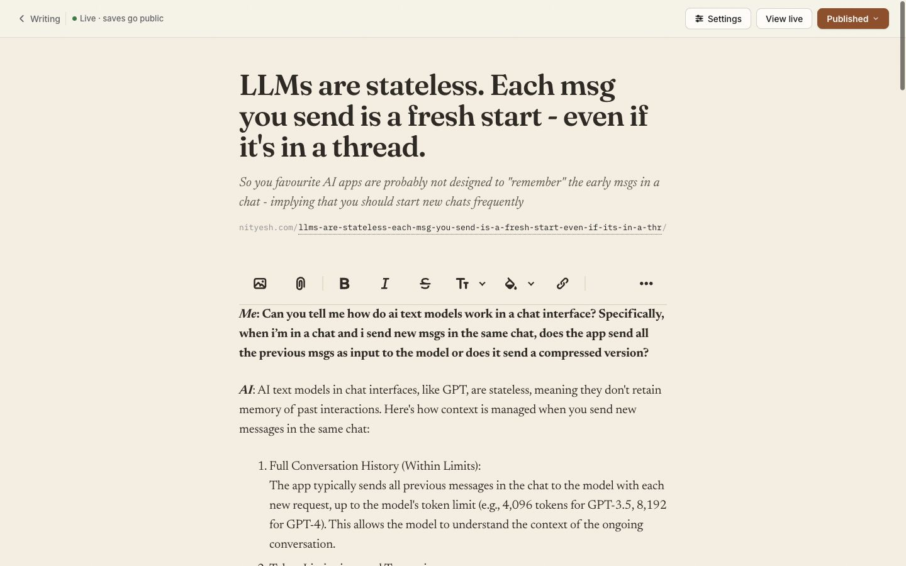
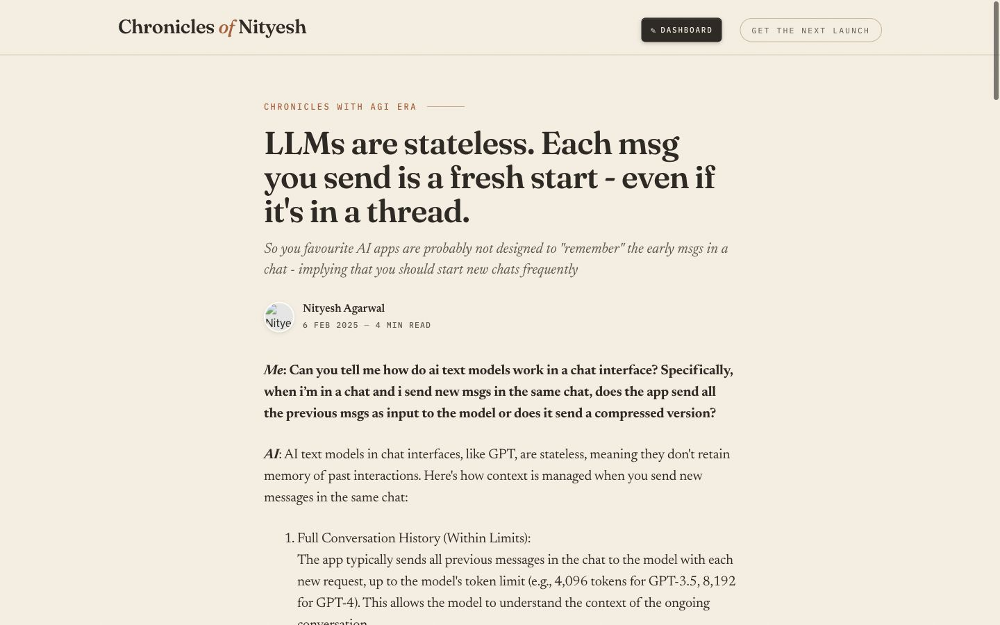

# P1 typography parity — the canvas is the page

Slice 1.1 + 1.3 of the writing plan. Receipts for two imported posts, the editor canvas against
the preview (`writing/posts/:slug` renders the public partial), same scroll: the body's top
edge at 90px. Measured with `getComputedStyle` on the first element of each kind inside
`.lexxy-editor__content` (canvas) and `.gh-content` (preview), Chrome 151, 2026-08-25.

Posts: `wth-does-a-neural-network-learn` (images, captions, quotes, rules, lists, `nn`) and
`llms-are-stateless-each-msg-you-send-is-a-fresh-start-even-if-its-in-a-thread` (h3s, lists,
a table, `llm`).

## Screenshots

| | Canvas | Preview |
|---|---|---|
| nn 1440 |  |  |
| nn 390 |  |  |
| llm 1440 |  |  |
| llm 390 |  |  |
| llm top of page |  |  |
| llm table |  |  |

Before, for the record: `before-*.jpg` (same names).

## Computed styles, first element of each kind

| First element (1440) | Canvas before | Canvas after | Preview | Same? |
|---|---|---|---|---|
| nn `p` | Newsreader 20px/31px 400 · rgb(20, 23, 26) · mt 0px | Newsreader 20px/31px 400 · rgb(43, 38, 32) · mt 0px | Newsreader 20px/31px 400 · rgb(43, 38, 32) · mt 28px | first canvas `p` is Lexxy's hidden provisional paragraph (margin 0 by the gem, height 5px); the first real paragraph sits 28px below the figure on both, see gaps |
| nn `h3` | Newsreader 26px/31.2px 700 · rgb(20, 23, 26) · mt 56px | Fraunces 26px/31.2px 600 · rgb(43, 38, 32) · mt 56px | Fraunces 26px/31.2px 600 · rgb(43, 38, 32) · mt 56px | yes |
| nn `h4` | Newsreader 23px/27.6px 700 · rgb(20, 23, 26) · mt 56px | Fraunces 23px/27.6px 600 · rgb(43, 38, 32) · mt 56px | Fraunces 23px/27.6px 600 · rgb(43, 38, 32) · mt 56px | yes |
| nn `li` | Newsreader 20px/31px 400 · rgb(20, 23, 26) · mt 0px | Newsreader 20px/31px 400 · rgb(43, 38, 32) · mt 0px | Newsreader 20px/31px 400 · rgb(43, 38, 32) · mt 0px | yes |
| nn `blockquote` | Newsreader 20px/31px 400 italic · rgb(92, 83, 71) · mt 10px | Newsreader 20px/31px 400 italic · rgb(92, 83, 71) · mt 28px | Newsreader 20px/31px 400 italic · rgb(92, 83, 71) · mt 28px | yes |
| nn `code` | ui-monospace 18px/27.9px 400 · rgb(20, 23, 26) · mt 0px | IBM Plex Mono 17px/26.35px 400 · rgb(43, 38, 32) · mt 0px | IBM Plex Mono 17px/26.35px 400 · rgb(43, 38, 32) · mt 0px | yes |
| nn `figcaption` | Newsreader 8.75px/13.5625px 400 · oklch(0.4 0 0) · mt 0px | Newsreader 15px/23.25px 400 italic · rgb(92, 83, 71) · mt 12px | Newsreader 15px/23.25px 400 italic · rgb(92, 83, 71) · mt 12px | yes |
| nn `hr` | Newsreader 20px/31px 400 · rgb(128, 128, 128) · mt 0px | Fraunces 20px/20px 400 · rgb(176, 92, 52) · mt 0px | Fraunces 20px/20px 400 · rgb(176, 92, 52) · mt 52px | canvas margin is on the `.horizontal-divider` figure Lexxy wraps the rule in; the 52px gap is identical, see gaps |
| nn `img` | Newsreader 20px/31px 400 · rgb(20, 23, 26) · mt 0px | Newsreader 20px/31px 400 · rgb(43, 38, 32) · mt 0px | Newsreader 20px/31px 400 · rgb(43, 38, 32) · mt 0px | yes |
| llm `table` | Newsreader 20px/31px 400 · rgb(20, 23, 26) · mt 2.4px | Newsreader 16.4px/23.78px 400 · rgb(43, 38, 32) · mt 0px | Newsreader 16.4px/23.78px 400 · rgb(43, 38, 32) · mt 32px | canvas margin is on Lexxy's `.lexxy-content__table-wrapper`; gap identical (32px) |
| llm `th` | Newsreader 20px/31px 700 · rgb(20, 23, 26) · mt 0px | Newsreader 16.4px/23.78px 600 · rgb(92, 83, 71) · mt 0px | Newsreader 16.4px/23.78px 600 · rgb(43, 38, 32) · mt 0px | imported inline `style` on the public cells (`padding-left:0px`, `color: rgb(var(--ds-rgb-label-1))`) — content, not CSS; the editor drops cell styles on import |
| llm `td` | Newsreader 20px/31px 400 · rgb(20, 23, 26) · mt 0px | Newsreader 16.4px/23.78px 400 · rgb(43, 38, 32) · mt 0px | Newsreader 16.4px/23.78px 400 · rgb(43, 38, 32) · mt 0px | same inline-style note as `th` |

Font family is the declared first family; the `<link>` is what proves it loads (`test/integration/typography_test.rb`), and the Fraunces/Newsreader shapes in the screenshots.

## Block gaps (px between consecutive top-level blocks)

| View | Canvas before | Canvas after | Preview |
|---|---|---|---|
| nn-1440 | P→FIGURE:0 FIGURE→P:10 P→P:10 P→FIGURE:0 FIGURE→BLOCKQUOTE:10 BLOCKQUOTE→BLOCKQUOTE:10 | P→FIGURE:0 FIGURE→P:40 P→P:28 P→FIGURE:52 FIGURE→BLOCKQUOTE:52 BLOCKQUOTE→BLOCKQUOTE:28 | FIGURE→P:40 P→HR:52 HR→BLOCKQUOTE:52 BLOCKQUOTE→BLOCKQUOTE:28 BLOCKQUOTE→P:28 P→P:28 |
| llm-1440 | P→P:10 P→OL:10 OL→P:10 P→UL:10 UL→OL:10 OL→H3:56 | P→P:28 P→OL:28 OL→P:28 P→UL:28 UL→OL:28 OL→H3:56 | P→P:28 P→OL:28 OL→P:28 P→UL:28 UL→OL:28 OL→H3:56 |
| nn-390 | P→FIGURE:0 FIGURE→P:10 P→P:10 P→FIGURE:0 FIGURE→BLOCKQUOTE:10 BLOCKQUOTE→BLOCKQUOTE:10 | P→FIGURE:0 FIGURE→P:40 P→P:28 P→FIGURE:52 FIGURE→BLOCKQUOTE:52 BLOCKQUOTE→BLOCKQUOTE:28 | FIGURE→P:40 P→HR:52 HR→BLOCKQUOTE:52 BLOCKQUOTE→BLOCKQUOTE:28 BLOCKQUOTE→P:28 P→P:28 |
| llm-390 | P→P:10 P→OL:10 OL→P:10 P→UL:10 UL→OL:10 OL→H3:56 | P→P:28 P→OL:28 OL→P:28 P→UL:28 UL→OL:28 OL→H3:56 | P→P:28 P→OL:28 OL→P:28 P→UL:28 UL→OL:28 OL→H3:56 |

The canvas list begins with Lexxy's hidden provisional paragraph (`P→FIGURE:0`), which is why its sequence is offset by one from the preview's; the gaps themselves are identical.

## Title and standfirst (family · size · weight · line-height · letter-spacing · colour · style)

| Field | Canvas before | Canvas after | Preview |
|---|---|---|---|
| llm-1440 title | Newsreader · 46px · 600 · 50.6px · -1.012px · rgb(20, 23, 26) · normal | Fraunces · 46px · 600 · 48.76px · -0.92px · rgb(43, 38, 32) · normal | Fraunces · 46px · 600 · 48.76px · -0.92px · rgb(43, 38, 32) · normal |
| llm-1440 subtitle | Newsreader · 19px · 400 · 27.55px · -0.342px · rgb(95, 97, 101) · normal | Newsreader · 21px · 400 · 30.45px · normal · rgb(92, 83, 71) · italic | Newsreader · 21px · 400 · 30.45px · normal · rgb(92, 83, 71) · italic |
| llm-390 title | Newsreader · 34px · 600 · 37.4px · -0.748px · rgb(20, 23, 26) · normal | Fraunces · 34px · 600 · 36.04px · -0.68px · rgb(43, 38, 32) · normal | Fraunces · 34px · 600 · 36.04px · -0.68px · rgb(43, 38, 32) · normal |
| llm-390 subtitle | Newsreader · 17px · 400 · 24.65px · -0.306px · rgb(95, 97, 101) · normal | Newsreader · 18.17px · 400 · 26.3465px · normal · rgb(92, 83, 71) · italic | Newsreader · 18.17px · 400 · 26.3465px · normal · rgb(92, 83, 71) · italic |

## Blockquote inset (review follow-up)

Trix's legacy `.trix-content blockquote { margin-left: .3em }` and `.trix-content li { margin-left: 1em }` shaped the page outside the shared list; the page's blockquote sat 6px in, the canvas's at 0. Both values now live once in the shared rules and the Trix LTR rules are gone (`actiontext.css`). Re-measured on `nn`:

| Width | Canvas margin-left · padding-left · border · x from body edge | Preview |
|---|---|---|
| 1440 | 6px · 24px · 3px rgb(176, 92, 52) · 6px | 6px · 24px · 3px rgb(176, 92, 52) · 6px |
| 390 | 5.4px · 24px · 3px rgb(176, 92, 52) · 5px | 5.4px · 24px · 3px rgb(176, 92, 52) · 5px |

`li` margin-left: 20px / 18px on both surfaces at 1440 / 390.

## What could not be made identical, and why

- **The imported table's cells.** The llm post's table came from a paste that carries inline `style` on every `th`/`td` (`padding-left:0px`, `border-bottom:1px solid rgb(var(--ds-rgb-label-3))`, `color:rgb(var(--ds-rgb-label-1))`). Loofah keeps those styles on the public page, so they beat the shared cell rule; the editor drops cell styles on import, so the canvas shows the site's table. Content, not CSS — a re-save from the editor would align them.
- **Image captions on imported `kg-image-card` figures.** Lexxy imports the figure as its own `.attachment` with a plain-text caption field, so a caption that carried links (`Photo by <a>…</a>`) becomes a paragraph under the image and the caption field shows the filename placeholder. That is the kg-dialect import (SPEC-0.3), not typography; the caption field itself now wears the public caption look.
- **Imported raw tweet embeds.** The nn post's Ghost `kg-embed-card` figure is unwrapped to a bare `blockquote` on import, so the canvas shows a pull-quote where the page shows a tweet. Same dialect issue.
- **Chrome.** The editor bar and Lexxy toolbar, and the public masthead and byline — by design.

## Tokens

All `--lexxy-*` values are set in one block on `.editor-canvas__body lexxy-editor` (application.css). The `--highlight-*` swatches are on `.gh-content, .editor-canvas__body lexxy-editor` rather than `:root`, so they beat Lexxy's own `:root` definitions by inheritance, not stylesheet order (checked: `--highlight-1` resolves to `#b05c34` on the page, swatches terracotta/terracotta-deep/spool-red on the canvas). `--lexxy-color-canvas` stays `transparent` so the prose sits on the paper; Lexxy also paints its dropdown panels with that token, which is what leaves them translucent — left for the toolbar slice (`p1/toolbar`).

## Headings

Lexxy 0.9.31's default preset is already `headings: ["h2", "h3", "h4"]`, so the dropdown offers exactly those. Markdown `# ` still produced an `h1` (Lexical's built-in shortcut list is not configurable); `app/javascript/lexxy_body_headings.js` demotes an h1 under the caret to h2 — `# ` now lands as h2, a stored h1 opened in the editor is left alone until edited.
